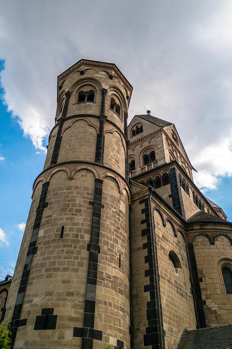
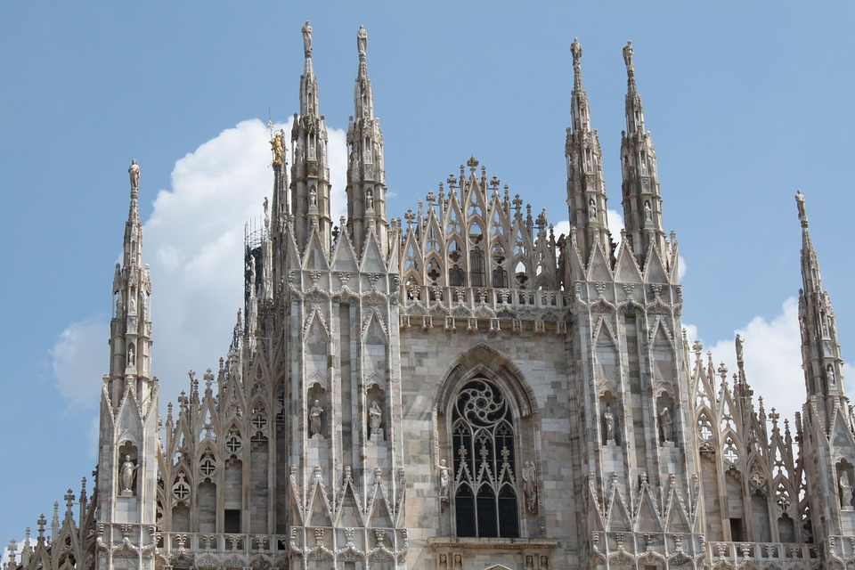
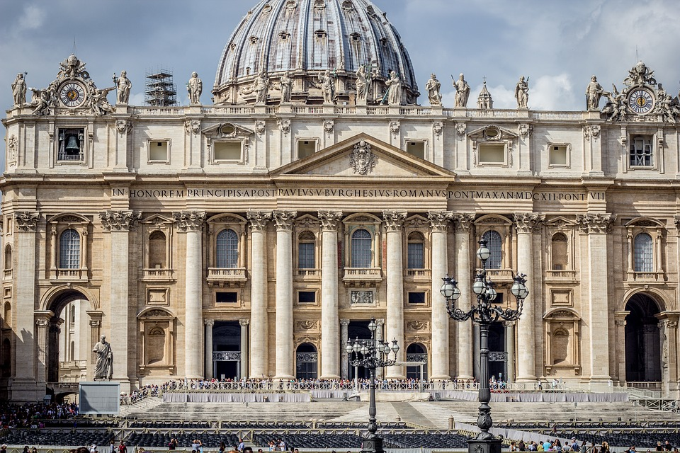
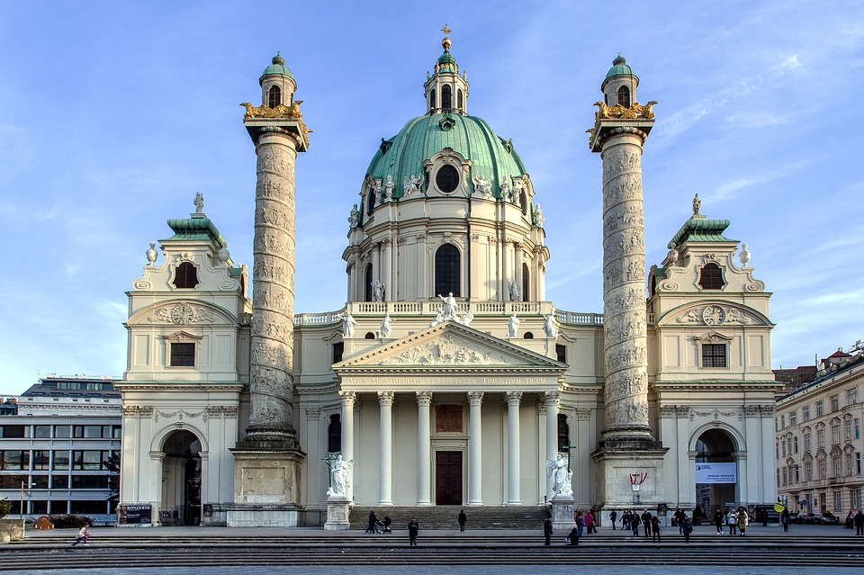

# Architectural style image classification

In this project, I try to build an Image Classifier to identify and classify architectural styles.
Data and tools are containerized with Docker.

1. In the first step, I build an MVP where I classify Romanesque and Gothic architecture.

Maria Laach Abbey            |  Milan Cathedral
:-------------------------:|:-------------------------:
  |  

2. If the classifier works correctly, I will add further architectural epochs like Renaissance and Baroque.

St. Peter's Basilica            |  St. Charles Church
:-------------------------:|:-------------------------:
  |  

3. If the classifier keeps producing correct predictions, I try to build an android app, where I offer the tool for the public.

Photos in the README by [Pixabay](https://pixabay.com/service/license)
